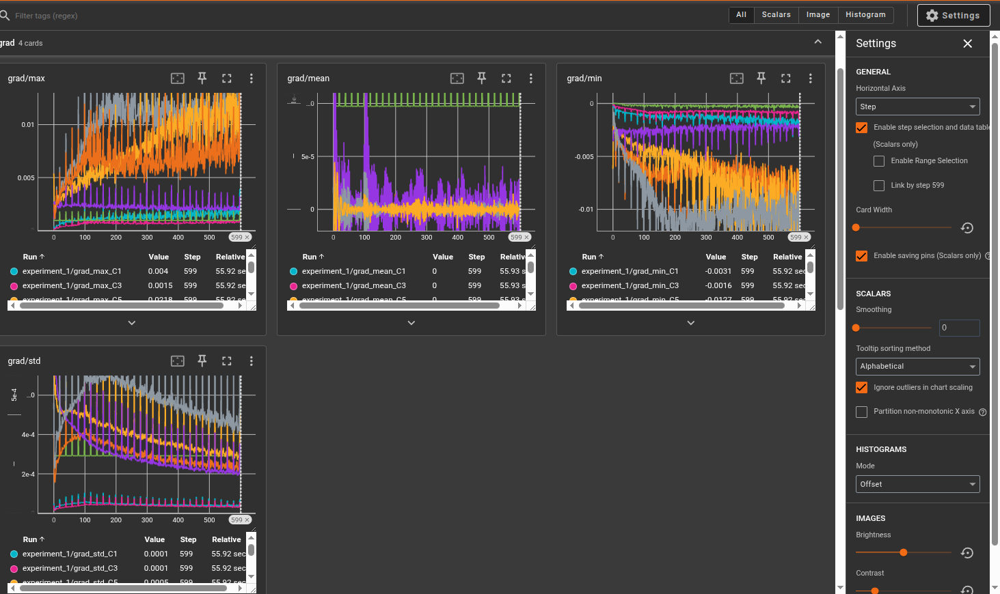

# LeNet-5: Original 1998 Implementation in PyTorch

This repository contains a faithful reconstruction of the **LeNet-5** architecture as described in the seminal paper: *"Gradient-Based Learning Applied to Document Recognition"* (LeCun et al., 1998).

## 🚀 Unique Features
Unlike "modern" LeNet variants, this implementation adheres to the specific technical details of the original paper:
* **Scaled Tanh Activation:** Uses $1.7159 \cdot \tanh(\frac{2}{3}x)$ to maintain signal variance.
* **Custom C3 Connectivity:** Implements the sparse connection table between S2 and C3 feature maps.
* **Linear Subsampling (S2/S4):** Uses learnable coefficients and biases rather than simple Max-Pooling.
* **RBF Output Layer:** Uses Euclidean Distance (penalties) against fixed 12x7 digit prototypes instead of standard Softmax.
* **Discriminative Loss:** Implements the specialized log-sum-exp penalty function (Equation 7 in the paper) to push incorrect class energies away.

## 🧠 Architecture Summary
1.  **C1:** Convolutional Layer (6 filters, 5x5)
2.  **S2:** Subsampling Layer (Average Pooling + Learnable Gain/Bias)
3.  **C3:** Sparse Convolutional Layer (16 filters, custom mapping)
4.  **S4:** Subsampling Layer
5.  **C5:** Convolutional Layer (120 filters, 5x5)
6.  **F6:** Fully Connected Layer (84 units)
7.  **Output:** RBF Layer (10 units, fixed prototypes)


## 🛠️ Installation & Setup
To avoid dependency conflicts, it is recommended to use a clean virtual environment.

1. **Clone the repository:**
   ```bash
   git clone [https://github.com/YOUR_USERNAME/LeNet5-Original-Implementation.git](https://github.com/YOUR_USERNAME/LeNet5-Original-Implementation.git)
   cd LeNet5-Original-Implementation
   ```

2. **Install requirements:**
   ```bash
   pip install -r requirements.txt
   ```

3. **Hardware Note:**
   This project is running on CPU.

## 📊 Usage
To begin training the model on the MNIST dataset:
```bash
python main.py
```

### Prediction Logic
Because the output layer is based on Radial Basis Functions (RBF), the model outputs a **penalty** (distance). To get the predicted class, we look for the **minimum** value:
$$ \text{prediction} = \arg\min(\text{output}) $$

## 📈 Monitoring with TensorBoard
This implementation includes a built-in training summary tool to visualize the network's internal dynamics in real-time.
What is tracked?
Activations (Forward Pass): Mean, Max, Min, and Standard Deviation of outputs for every layer (C1 through F6).
Gradients (Backward Pass): Monitor the flow of gradients to ensure the "Scaled Tanh" layers aren't saturating or vanishing.

### How to run it
Start the TensorBoard server from your project root:

```bash
tensorboard --logdir=runs/
```
Open your browser and navigate to http://localhost:6006.

### Example Dashboard


The dashboard allows you to compare the "energy" of different layers. You should see the standard deviation of your activations staying relatively stable across layers if the initialization is correct.

## 📜 References
* LeCun, Y., Bottou, L., Bengio, Y., & Haffner, P. (1998). Gradient-based learning applied to document recognition. Proceedings of the IEEE.
